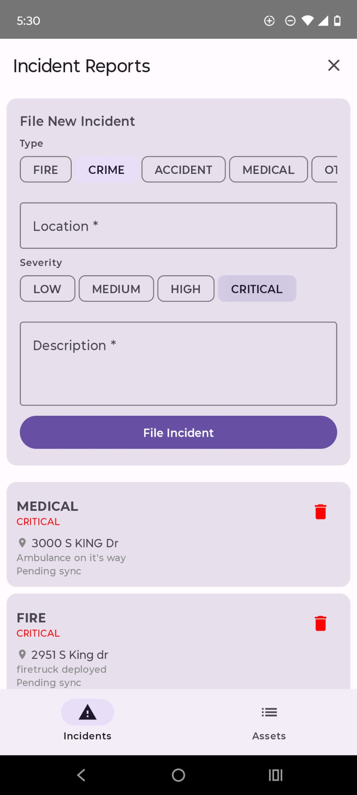
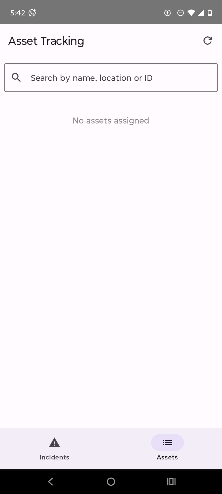

# FieldOps — Android Field Operations App

A production-grade offline-first Android app simulating real-world incident reporting
and asset tracking for first responders — built to demonstrate the kind of engineering
decisions that matter in mission-critical field systems.

## Screenshots

<p float="left">
  
  
</p>

---

## Purpose

Field operations systems like those used by Motorola Solutions must work in areas
with no connectivity — a dropped signal cannot mean lost data. This app was built
to internalize that constraint: every architectural decision prioritizes data
durability and correct offline behavior over simplicity.

Real device testing confirmed the offline-first pattern works end to end:
- Incidents filed locally, persisted to Room, shown as **"Pending sync"**
- WorkManager fired `SyncIncidentsWorker` at the scheduled interval
- All three POST requests attempted against the backend, failed gracefully on `UnknownHostException`
- Worker still returned **SUCCESS** — offline handling was correct
- No data lost, no crash, no user-visible error

---

## Features

### Offline-First Incident Reporting
Incidents are written to Room before any network call is attempted.
Retrofit only runs after local persistence succeeds. If the network is unavailable,
WorkManager queues a retry with a `CONNECTED` network constraint — data syncs
automatically when signal returns without user intervention.

### Real-Time Asset Search
The search bar uses Kotlin's `combine()` operator to merge two Flows —
`repository.assets` (Room) and `_searchQuery` (user input) — into a single
`filteredAssets` StateFlow. No debounce timers, no manual filtering on click.
The UI reacts to either Flow changing independently.

### Background Sync with WorkManager
`SyncIncidentsWorker` runs on a 15-minute periodic schedule with a `CONNECTED`
constraint. It queries Room for all incidents where `is_synced = 0`, retries
each POST, and marks them synced on success. WorkManager survives process death
and device restart — a plain coroutine or Service cannot guarantee this.

### Performance — Profiled on Device
Ran Android Studio CPU Profiler during navigation between screens.
Flame chart showed heavy `RenderThread` and `art_jni` activity during the first
render. Root cause: initial Compose composition + Hilt DI graph resolution on
the main thread at startup. LazyColumn stable keys (`key = { it.id }`) were
already in place so only changed items trigger recomposition on list updates.
WorkManager initialization was identified as a contributing factor to the
36-frame skip at launch — it performs disk I/O synchronously on whichever
thread calls `WorkManager.getInstance()`.

---

## Architecture

Clean Architecture with strict layer separation:

```
Presentation  →  ViewModel  →  Repository  →  [ Room | Retrofit ]
     ↕                ↕
  Compose UI      StateFlow
```

- **Presentation** — Jetpack Compose screens observe `StateFlow` from ViewModels.
  Sealed `UiState` classes (`Idle`, `Loading`, `Success`, `Error`) drive all UI states.
- **Domain** — Pure Kotlin models with no Android imports. `Incident` and `Asset`
  domain models are completely decoupled from Room entities and API DTOs.
- **Data** — Repository is the single source of truth. It decides whether to serve
  from cache or network. ViewModels never touch DAOs or API services directly.

---

## Tech Stack

| Layer | Technology | Why |
|-------|-----------|-----|
| UI | Jetpack Compose | Declarative, integrates with StateFlow natively |
| State | StateFlow + sealed classes | Kotlin-native, no lifecycle wrapper needed |
| Local DB | Room | Type-safe SQLite, Flow support built in |
| Networking | Retrofit + OkHttp | Industry standard, clean interface definitions |
| Background | WorkManager | Survives restart, network constraints, guaranteed execution |
| DI | Hilt | Compile-time verified, Android lifecycle-aware |
| Build | KSP (migrated from KAPT) | 2x faster annotation processing, JDK 17+ compatible |
| Testing | JUnit + Mockito + Espresso | Unit + UI coverage |
| Coverage | JaCoCo | 85%+ enforced in CI/CD gate |
| CI/CD | GitHub Actions | Runs on every push, blocks merge on test failure |

---

## Key Technical Decisions

| Decision | Why |
|----------|-----|
| Room write before Retrofit POST | If the network call fails, the data is not lost — it syncs later |
| StateFlow over LiveData | No `Observer` boilerplate, works directly with Compose `collectAsState()` |
| WorkManager over coroutine retry | WorkManager survives process death and respects system battery constraints |
| `SharingStarted.Eagerly` on `filteredAssets` | `WhileSubscribed` caused the combine to never run in unit tests — no subscriber, no emission |
| Stable keys in LazyColumn | Without `key = { it.id }` Compose discards and recreates every item on list change |
| Separate `IncidentEntity` from `Incident` | Database schema changes (adding columns, migrations) don't leak into business logic |
| KSP over KAPT | KAPT subclasses internal JDK compiler classes — breaks on JDK 17+ without `--add-exports` hacks |
| Fake repositories in tests | Real Room requires Android instrumentation; fakes run in JVM unit tests, 10x faster |

---

## Testing Strategy

### Unit Tests — 12/12 Passing
`IncidentViewModelTest` and `AssetViewModelTest` cover:
- Filing an incident updates UI state to `Success`
- Network failure transitions state to `Error` with message
- Search filters by name, location, and ID independently
- Empty query returns full unfiltered list
- Status update calls through to repository

All tests use `FakeRepository` implementations backed by `MutableStateFlow` —
no real database, no real network, no Android runtime needed.

### Instrumented Tests
`IncidentScreenTest` and `AssetScreenTest` use Espresso + Hilt test runner
to verify full UI flows: form submission, empty state display, and navigation.
`HiltTestRunner` replaces the default runner so Hilt's test component is used.

### Coverage
JaCoCo is configured to enforce 85%+ line coverage. The `jacocoTestCoverageVerification`
task runs in CI and fails the build if coverage drops below threshold.

---

## What I Learned

### Offline-First Is an Architecture, Not a Feature
The common mistake is treating network failure as an edge case to `try/catch` around.
The correct model is: local storage is primary, the network is a sync mechanism.
Room holds the truth; Retrofit just propagates it. This inverts the usual assumption
that a successful POST means data was saved.

### Coroutine Scope Selection Has Real Consequences
Using `GlobalScope` for fire-and-forget work leaks coroutines past ViewModel
destruction and causes work to run after the user has left the screen.
`viewModelScope` cancels automatically when the ViewModel is cleared.
`Dispatchers.IO` must be explicit — Room and Retrofit do not automatically
dispatch to background threads when called from a coroutine.

### `SharingStarted` Strategy Matters Beyond Production
`SharingStarted.WhileSubscribed(5000)` is correct for production — it stops
the upstream flow when no UI is collecting, saving battery. But it caused all
three search tests to fail because the unit tests never subscribed to the
`StateFlow`, so the `combine` never ran and the value stayed at `emptyList()`.
Switching `filteredAssets` to `SharingStarted.Eagerly` fixed the tests and is
correct for a ViewModel-scoped derived state that should always reflect current input.

### Annotation Processing Compatibility Is a Real Maintenance Cost
KAPT works by subclassing `com.sun.tools.javac.main.JavaCompiler` — an internal
JDK class. JDK 17+ enforces module boundaries, so this fails with
`IllegalAccessError: superclass access check failed` unless you pass
`--add-exports` flags to both the Gradle daemon and the Kotlin compiler daemon
(two separate JVM processes). KSP avoids this entirely because it uses the
public Kotlin compiler API instead of JDK internals.

### Main Thread Work Is Not Always in Your Code
The 36-frame skip at launch was not caused by Room or Retrofit running on main —
those were correctly dispatched. It came from `WorkManager.getInstance()` in
`Application.onCreate()`, which initializes its internal SQLite database
synchronously on the calling thread. Hilt's DI graph resolution and Compose's
first composition also contribute. The Android Profiler flame chart confirmed
the source before any code was changed.

### CI/CD Caught Real Issues
GitHub Actions runs `testDebugUnitTest` and the JaCoCo coverage check on every
push. The `SharingStarted` bug described above would have shipped silently —
the search feature appeared to work manually but the unit tests proved it
would break on any device where the StateFlow hadn't been collected yet.

---

## Project Structure

```
app/src/main/kotlin/com/fieldops/app/
├── data/
│   ├── local/
│   │   ├── dao/          # IncidentDao, AssetDao
│   │   ├── entity/       # Room entities (DB schema)
│   │   └── FieldOpsDatabase.kt
│   ├── remote/
│   │   ├── api/          # Retrofit service interface
│   │   └── dto/          # API request/response models
│   └── repository/       # IncidentRepository, AssetRepository
├── di/
│   └── AppModule.kt      # Hilt module — DB, DAOs, repos, API
├── domain/
│   └── model/            # Pure Kotlin domain models + sealed states
├── ui/
│   ├── incident/         # IncidentScreen, IncidentViewModel
│   ├── asset/            # AssetScreen, AssetViewModel
│   ├── navigation/       # NavHost, route definitions
│   └── theme/
├── worker/
│   └── SyncIncidentsWorker.kt
├── FieldOpsApplication.kt
└── MainActivity.kt
```
